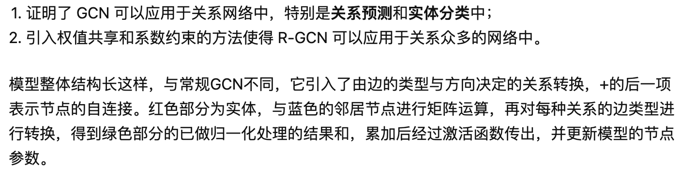
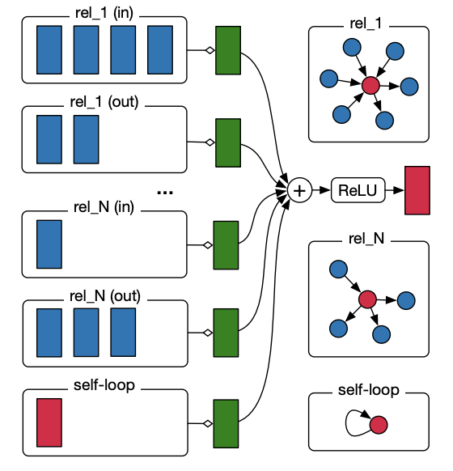
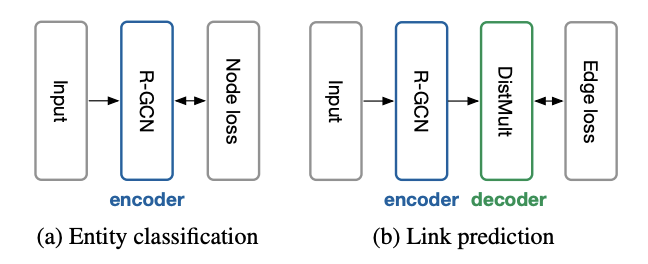
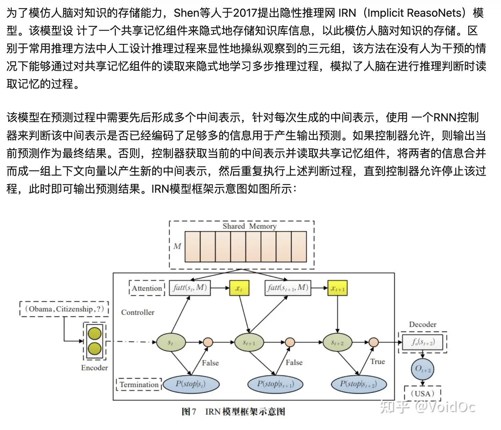

基于神经网络的推理

NTN R-GCN IRN

[NTN(Netural Tensor Networks)](https://arxiv.org/pdf/1301.3618.pdf)

[R-GCN](https://arxiv.org/pdf/1703.06103.pdf)

[IRN(Implicit ReasoNet)](https://openreview.net/pdf?id=r1PRvK9el)

