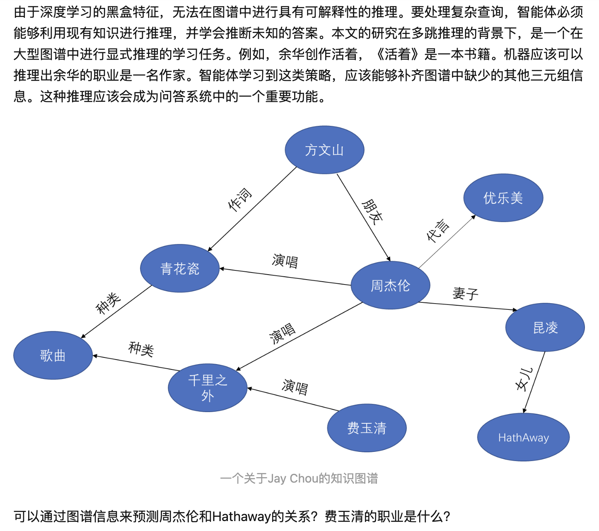
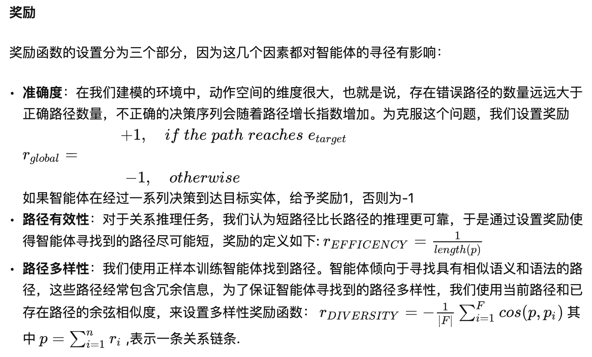
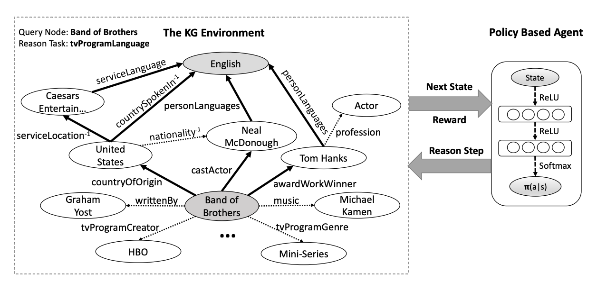
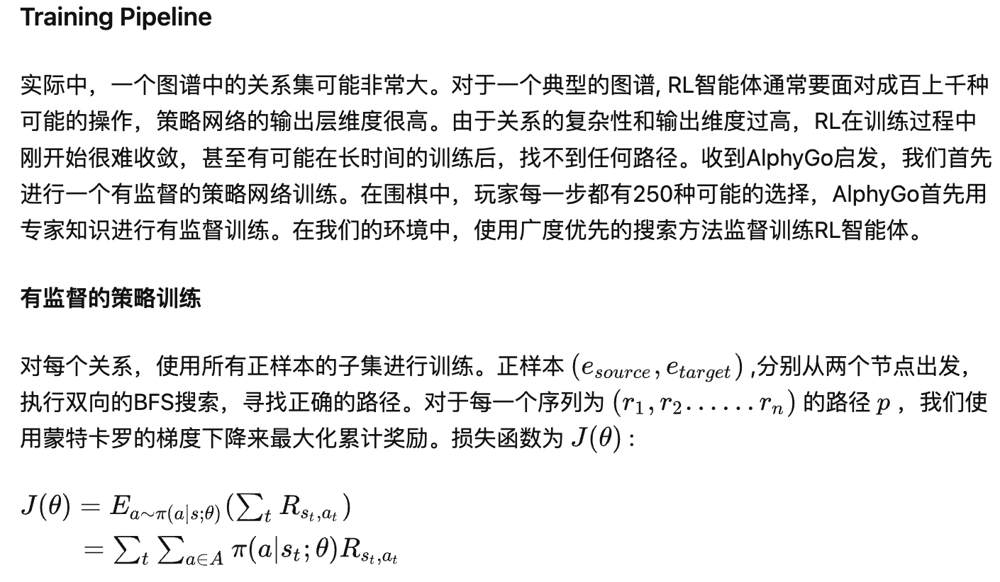
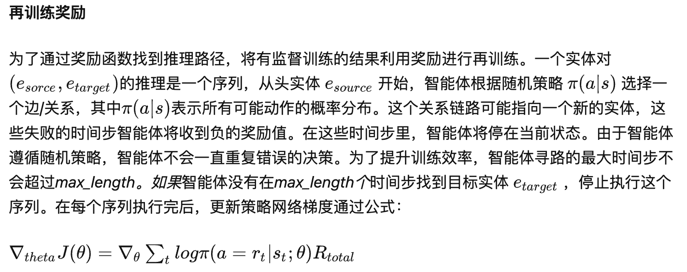
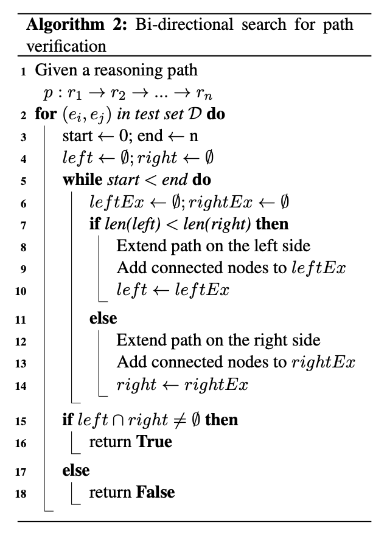

DeepPath

**基于强化学习的方法** DeepPath和MINERVA

**DeepPath**

[1] [**DeepPath: A Reinforcement Learning Method for Knowledge Graph Reasoning**](https://arxiv.org/pdf/1707.06690.pdf)

[**代码**](https://github.com/xwhan/DeepPath)

DeepPath的动作是“事实判断”（fact prediction），即确定一个三元组是否成立。 作者将“事实判断”看作是这样一个问题：寻找一条能连接已知头实体h和尾实体t的路径，并将此问题建模为序列决策问题，并利用基于策略梯度的强化学习方法REINFORCE求解。

对于大规模知识图谱中的多跳推理问题，提出的一种强化学习框架下的推理方法：使用连续空间中训练的策略梯度（policy gradient）方法，使用知识嵌入的方法将数据表达成低维向量对数据进行预处理。最后通过在图谱中最有可能组成推理路径的边。进行实验与随机游走算法PRA算法进行了比较，并且结果优于PRA。

在此之前，PRA是图谱中一种很有前景的路径推理方法。PRA使用基于重启的随机游走推理方法，执行多个有界深度优先搜索过程来查找关系路径，使用监督学习选择更合理的路径。然而PRA在一个完全离散的环境中进行推理，很难区分相似的实体和关系。

本文提出了一种新的 可控制的多跳推理方法：将路径推理建模为强化学习过程。相比PRA，DeepPAth利用知识嵌入的方法（transE）来编码连续的状态空间。智能体 通过对关系采样来寻找路径，为了更好引导智能体寻找关系推理路径，本文采用基于策略的强化学习方法。最后，展示了本文的方法在FreeBase数据集上优于PRA和知识表示的方法。

我们的RL模型概述。左: 由MDP建模的KG环境E。虚线箭头 (部分) 显示KG中的现有关系链接，粗体箭头显示RL代理找到的推理路径。− 1表示关系的倒数。
右: 策略网络代理的结构在每个步骤中，通过与环境交互，代理学会选择关系链接以扩展推理路径。

