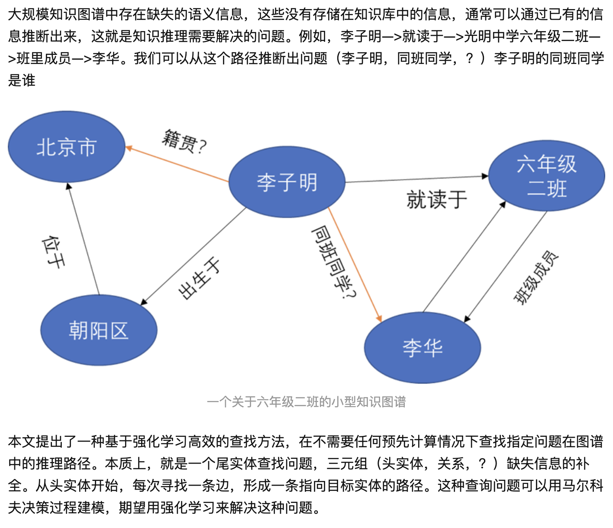
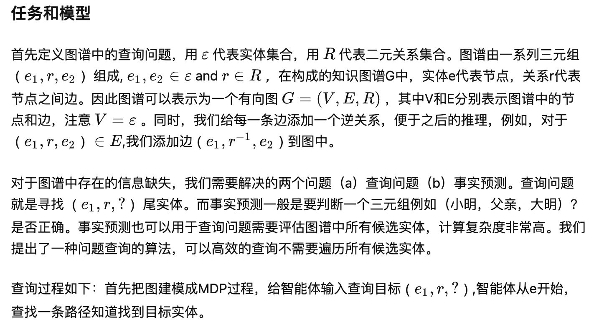
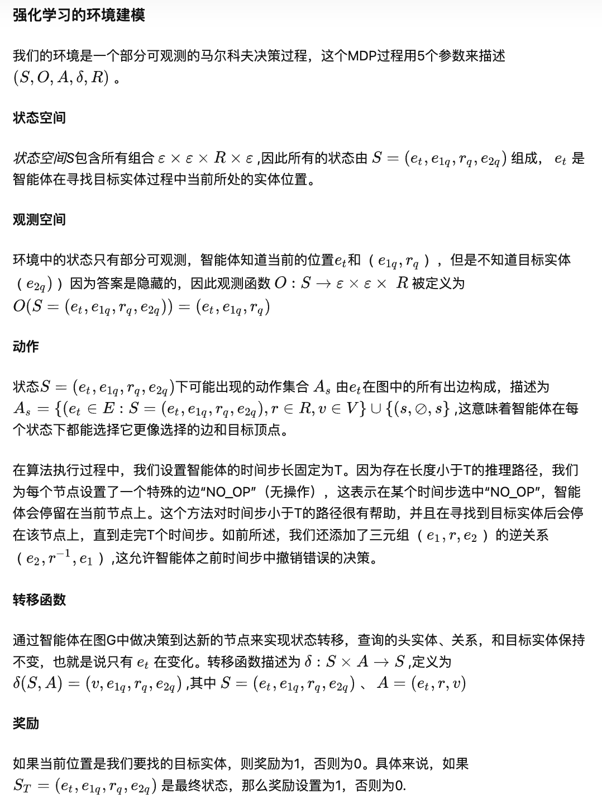
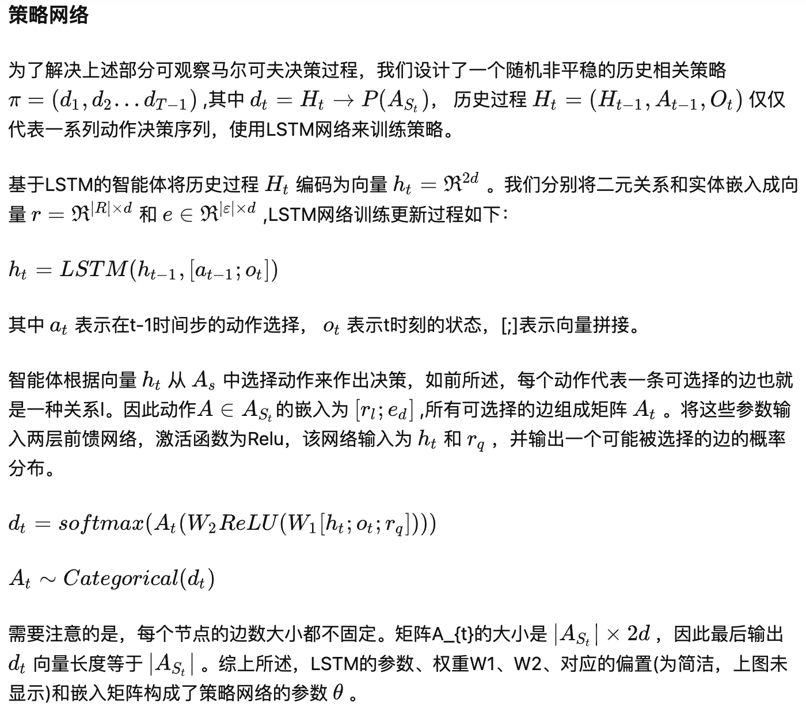
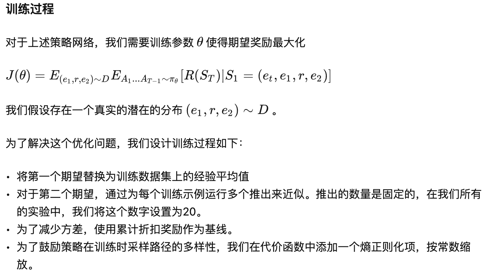

MinERVA

基于强化学习的方法 DeepPath和MINERVA

**MINERVA**

[2] [**Go for a Walk and Arrive at the Answer: Reasoning Over Paths in Knowledge Bases using Reinforcement Learning**](https://arxiv.org/pdf/1711.05851.pdf)

[**代码**](https://github.com/shehzaadzd/MINERVA)

而MINERVA的动作是“查询问答”（QA），“查询问答”无法预知答案对应的尾实体，需要从知识图谱的全部实体中寻找可作为答案的正确尾实体。为了解决这样一个 POMDP 过程，作者将观测序列和历史决策序列用 LSTM 建模表示，使得其的表现远远超过了非增强学习的基于随机游走的模型。

MINERVA的基于强化学习的方法有许多优点：

- 对推理路径的长度没有限制，可以用来解决比较复杂的长链推理问题。
- 不需要预训练（DeepPath中由于状态空间大，智能体在训练过程很难收敛，要先进行有监督训练）
- 查找效率很高，在头实体的一个邻域范围查找目标实体，不需要对图谱中的所有实体进行排序。
- 基于路径的知识推理具有可解释行（相比表示学习）

