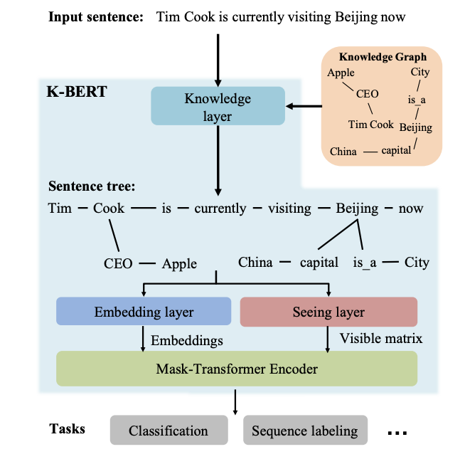
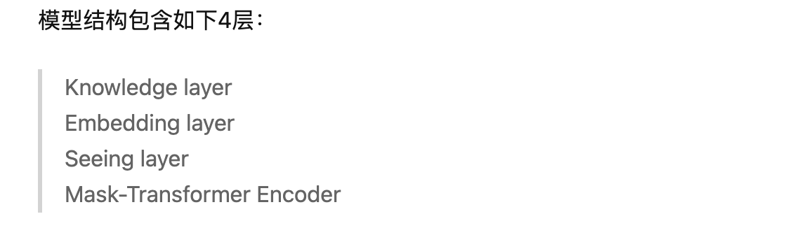
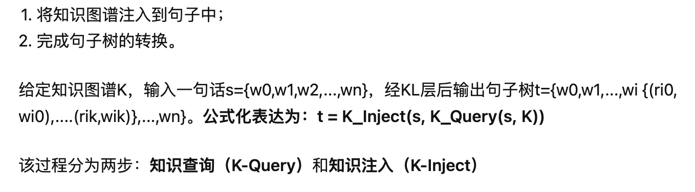
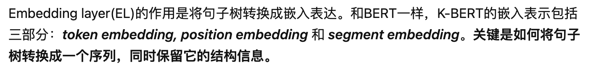
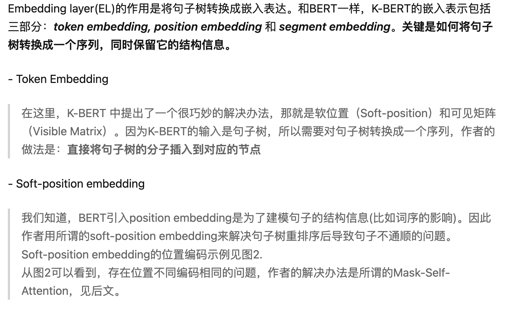
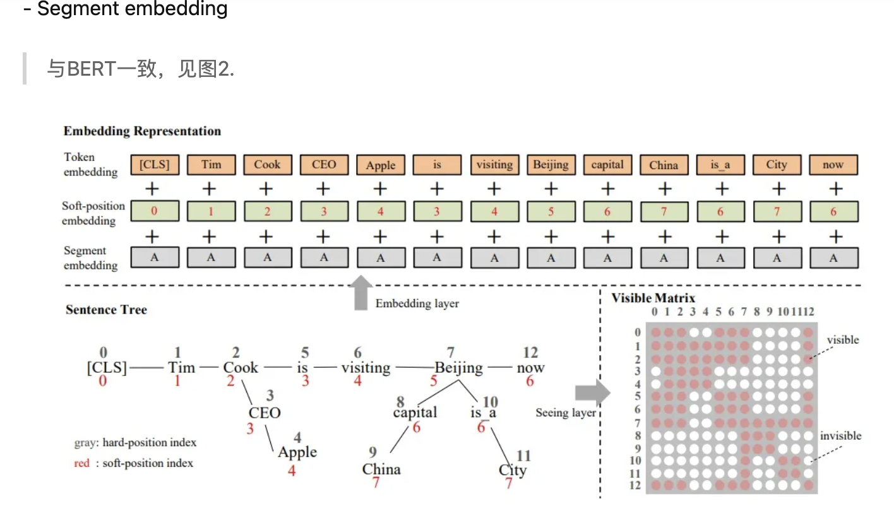
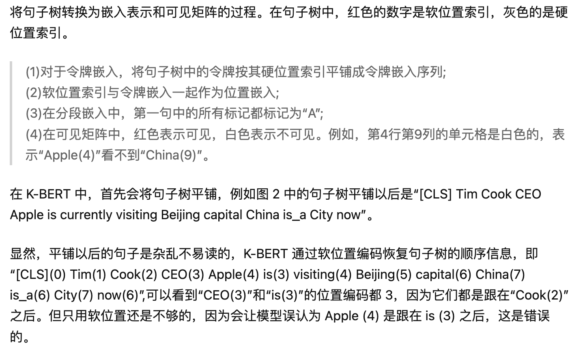
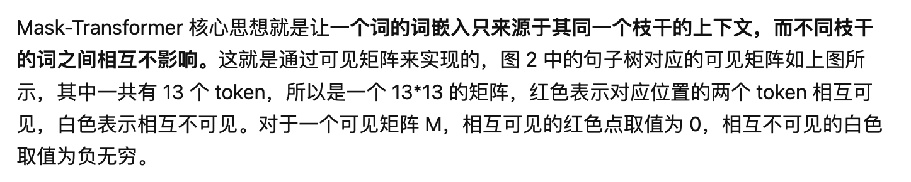
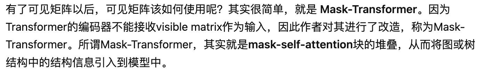
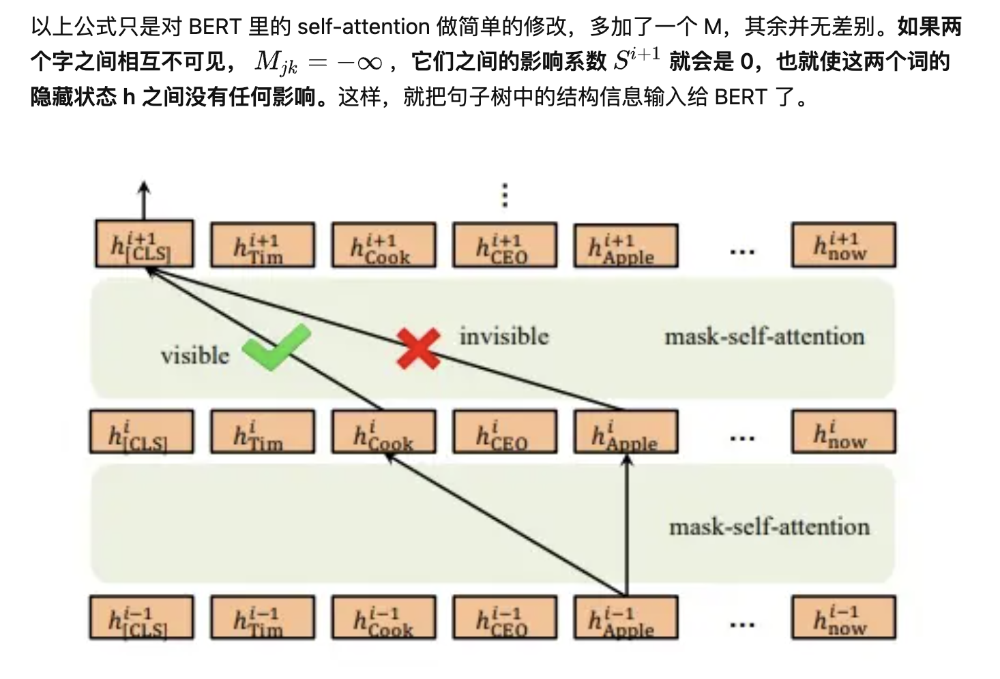

**K-BERT** 2020

K-BERT: 使用知识图启用语言表示

北大-腾讯联合推出知识赋能的一个模型，可以实现**文本分类**和**实体识别**等任务

[**K-BERT: Enabling Language Representation with Knowledge Graph**](https://arxiv.org/pdf/1909.07606v1.pdf)

[**代码**](https://github.com/autoliuweijie/K-BERT)

**Knowledge layer**

**Embedding layer**

**Seeing Layer**

**Mask-Transformer Encoder**

