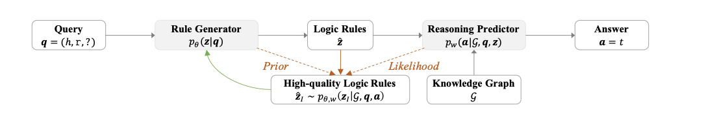

**RNNLogic** 2021

RNNLogic: 学习知识图推理的逻辑规则

基于逻辑规则的图谱推理

[**RNNLogic: Learning Logic Rules for Reasoning on Knowledge Graphs**](https://arxiv.org/pdf/2010.04029.pdf)

[**代码**](https://github.com/DeepGraphLearning/RNNLogic)

在我们的研究里主要考虑链式的逻辑规则，可以将链式的逻辑规则变成一个关系序列，其中用END来表示结尾。那很自然的，我们可以通过LSTM来生成这些不同的链式逻辑规则，并输出每一条逻辑规则的概率，进而得到一个弱逻辑规则的集合。

接着我们使用了一个叫做随机逻辑编程（stochastic logic programming）的框架来去定义预测器。会通过生成器的弱关系集合进行游走，如图中所示的两种关系链，第一种可以得到France这个答案，第二个逻辑规则可以得到France，Canada和US三个答案。对于每个潜在答案，我们可以给它定义一个分数，也就是到达这个实体的逻辑规则的weight的和。最后就可以根据分数得到每种答案的概率，挑选出那些概率最大的来当成我们最终的答案。

当前方法的主要难点是如何优化，因为无论是生成器还是预测期，都是动态学习的，所以优化起来可能会有一定难度。而我们发现生成器和预测器两者的难度是不同的，前者由于对后者的依赖，使得生成器是需要依赖于预测器的结果来进行动态调整的，所以生成器会更难些。

为了解决这个难点，我们提出了上图所示的框架。像之前的一些方法，是给定了一个生成器生成了一些逻辑规则送给预测期，让预测器给生成器反馈这个逻辑规则的集合是好还是坏。我们的思路是希望预测器给生成器的反馈更加具体，譬如哪几条规则更重要，从而帮助生成器更好地去更新，得到更好的结果。最后，整个优化的过程可以如下表示：

首先第一步，给定一个查询（Query），让生成器生成很多逻辑规则，再把逻辑规则和知识图谱同时送到预测器里面，去更新预测器，最大化生成正确答案的概率。

接着，从所有生成的这些逻辑规则里面去挑选出那些最重要的逻辑规则。这里我们通过使用后验推断的方法来计算每一条弱的逻辑规则的后验概率进行挑选。因此，在整个过程中，每一条弱的规则概率是由生成器来提供的，似然函数由预测器来提供。这样结合两者共同的信息来得到一个比较重要的逻辑规则。

最后，我们就可以把找到的高质量的逻辑规则当成训练数据，送回生成器去学习。

通过这些规则在图谱里我们会得到不同的路径，然后对于这些路径我们用不同的方法来打分。比如上图我们既用了LSTM的Score，也用了图嵌入（KGE）的Score来打分，来得出我们最终预测结果的得分和答案。

